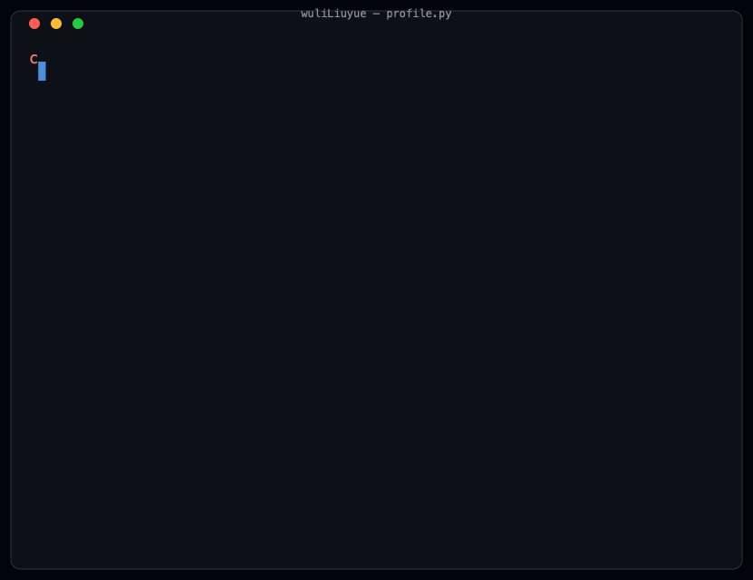

<!-- 个性化 Banner（AI 生成）将在确认后插入此处 -->

<h2 align="center">👋 Hello, I'm WuliLiuyue</h2>

  

  
  

<h2 align="center">💻 About Me</h2>

  

<h2 align="center">🛠️ Tech Stack</h2>

<h3 align="center">Languages</h3>

  

<h3 align="center">Frameworks</h3>

  

<h3 align="center">Tools</h3>

  

<h2 align="center">📊 GitHub Stats</h2>

  
  

  

<h2 align="center">⚡ Activity</h2>

  

  

  

  ⭐ Thanks for visiting my profile

